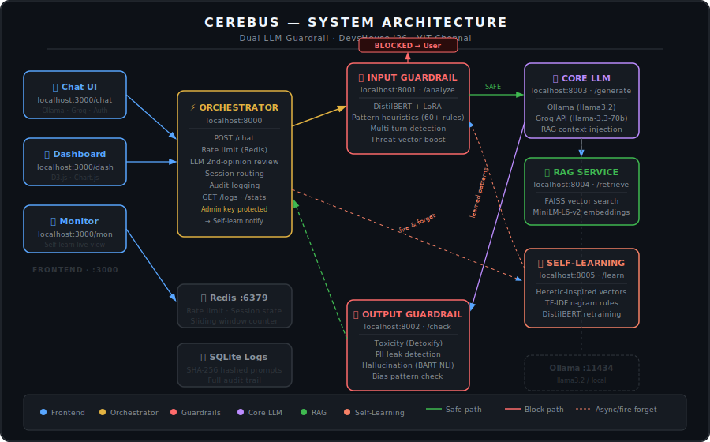
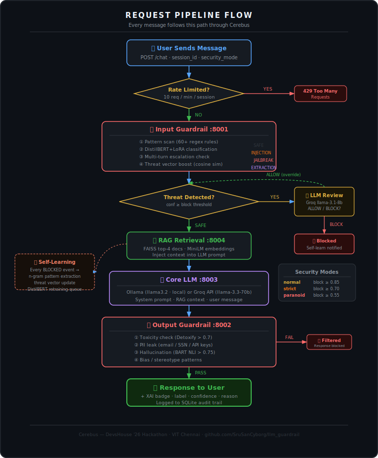
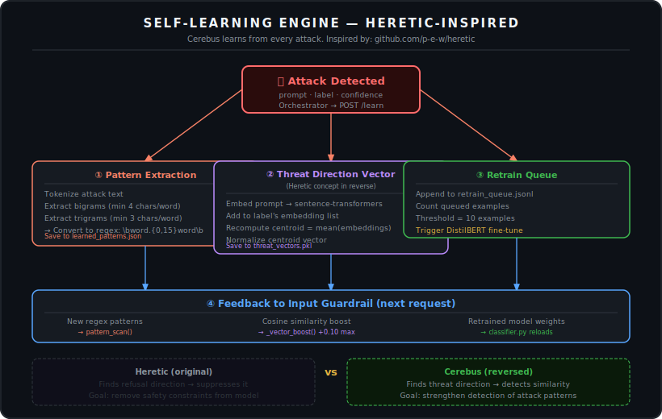

# 🛡 Cerebus — Dual LLM Guardrail System

> **Production-grade AI security gateway** that wraps any LLM with two independent safety layers — blocking prompt injections, jailbreaks, sensitive data extraction, toxic output, PII leaks, and hallucinations — with full explainability, audit logging, and a self-learning engine that adapts to new attacks.

Built for **DevsHouse '26 Hackathon** @ VIT Chennai.

---

## System Architecture



---

## Request Pipeline



---

## Self-Learning Engine



---

## Table of Contents

- [What is Cerebus?](#what-is-cerebus)
- [Services & Ports](#services--ports)
- [Architecture Deep Dive](#architecture-deep-dive)
- [Threat Detection](#threat-detection)
- [Self-Learning Engine](#self-learning-engine-1)
- [LLM Providers](#llm-providers)
- [Project Structure](#project-structure)
- [Prerequisites](#prerequisites)
- [Installation & Setup](#installation--setup)
- [Environment Variables](#environment-variables)
- [Running Locally](#running-locally)
- [API Reference](#api-reference)
- [Frontend Interfaces](#frontend-interfaces)
- [Security Modes](#security-modes)
- [Tech Stack](#tech-stack)

---

## What is Cerebus?

Cerebus is a **microservices-based AI guardrail system** that wraps LLMs (Ollama + Groq) with two independent security layers. Every message travels through a strict pipeline:

```
User → Rate Limit → Input Guardrail → LLM Review → RAG → Core LLM → Output Guardrail → User
```

Every blocked event feeds back into the **self-learning engine**, which auto-generates new detection rules and fine-tunes the classifier — the system gets smarter after every attack.

---

## Services & Ports

| Service | Port | URL | Description |
|---|---|---|---|
| **Orchestrator** | `8000` | `http://localhost:8000` | Main API gateway — routes all requests, rate limiting, LLM review layer |
| **Input Guardrail** | `8001` | `http://localhost:8001` | Prompt threat detection — DistilBERT + LoRA + 60+ regex rules |
| **Output Guardrail** | `8002` | `http://localhost:8002` | Response safety — toxicity, PII, hallucination, bias |
| **Core LLM** | `8003` | `http://localhost:8003` | LLM wrapper — Ollama (local) or Groq API |
| **RAG Service** | `8004` | `http://localhost:8004` | FAISS vector retrieval + context injection |
| **Self-Learning** | `8005` | `http://localhost:8005` | Heretic-inspired threat direction learning engine |
| **Frontend** | `3000` | `http://localhost:3000` | Chat UI + SOC Dashboard + Attack Monitor |
| **Ollama** | `11434` | `http://localhost:11434` | Local LLM inference (external dependency) |
| **Redis** | `6379` | `redis://localhost:6379` | Rate limiting + session state |

### Frontend Pages

| Page | URL |
|---|---|
| Chat | `http://localhost:3000/chat/` |
| SOC Dashboard | `http://localhost:3000/dashboard/` |
| Attack & Learn Monitor | `http://localhost:3000/monitor/` |

---

## Architecture Deep Dive

### Orchestrator `:8000`

The single entry point. Handles:
- **Rate limiting** — 10 requests/min/session via Redis sliding window
- **Input guardrail call** — sends prompt to `:8001/analyze`
- **LLM second-opinion review** — when a prompt is flagged (conf < 0.92), calls Groq `llama-3.1-8b-instant` to confirm: `ALLOW` or `BLOCK`
- **RAG context injection** — fetches top-4 relevant docs from `:8004`
- **Core LLM call** — sends enriched prompt to `:8003`
- **Output guardrail call** — validates LLM response via `:8002`
- **Self-learning notification** — fire-and-forget POST to `:8005/learn` after every block
- **Admin endpoints** — `/logs` and `/stats` behind `x-api-key` header

### Input Guardrail `:8001`

Four-stage classification pipeline:

```
Stage 1: Pattern Scan       → 60+ static regex rules across 13 threat categories
Stage 2: DistilBERT + LoRA  → Fine-tuned 5-class classifier
Stage 3: Multi-turn check   → Sliding window of last 5 messages per session
Stage 4: Vector boost       → Cosine similarity to known attack centroids (+0.10 max)
```

**Output labels:**

| Label | Description |
|---|---|
| `SAFE` | No threat detected |
| `PROMPT_INJECTION` | Attempts to override system instructions |
| `JAILBREAK` | Social engineering / encoding tricks |
| `SENSITIVE_EXTRACTION` | Trying to steal system prompts, training data, API keys |
| `HARMFUL_CONTENT` | Violence, weapons, illegal activity (60+ patterns) |

### Output Guardrail `:8002`

Four parallel validators on every LLM response:

| Check | Method | Threshold |
|---|---|---|
| Toxicity | Detoxify library | score > 0.7 |
| PII Leak | Regex (email, SSN, credit cards, API keys) | any match |
| Hallucination | Facebook BART-Large-MNLI (NLI) | contradiction > 0.75 |
| Bias | Stereotype phrase patterns | any match |

### Core LLM `:8003`

Supports two providers selected per-request:

| Provider | Model | Notes |
|---|---|---|
| **Ollama** | `llama3.2` (default) | Fully local, no API key needed |
| **Groq** | `llama-3.3-70b-versatile` | Cloud inference, configured via `.env` |

The system prompt instructs the LLM to **never refuse on security grounds** — that is handled entirely by the guardrails, not the model.

### RAG Service `:8004`

- Document store in `cerebus/rag/docs/` (`.txt` / `.pdf`)
- Indexed via **FAISS** + **all-MiniLM-L6-v2** embeddings
- Injects top-4 relevant chunks as context into every safe request
- Falls back gracefully if offline

### Self-Learning Engine `:8005`

Heretic-inspired (reversed) threat direction system:

```
Every BLOCKED prompt →
  ① Extract bigrams/trigrams → new regex patterns → learned_patterns.json
  ② Embed with sentence-transformers → update threat centroid per label
  ③ Queue example → retrain_queue.jsonl
  ④ At 10 examples → auto trigger DistilBERT fine-tuning
```

The input guardrail hot-reloads `learned_patterns.json` every 60 seconds and applies the new rules to all incoming requests.

---

## Threat Detection

### Security Modes

| Mode | Block Threshold | Flag Threshold | Use Case |
|---|---|---|---|
| `normal` | ≥ 0.85 | ≥ 0.70 | Default — balanced |
| `strict` | ≥ 0.70 | ≥ 0.55 | Sensitive deployments |
| `paranoid` | ≥ 0.55 | ≥ 0.40 | Maximum security |

### LLM Second-Opinion Review

When confidence is between the flag and block thresholds (and < 0.92), the orchestrator calls `Groq llama-3.1-8b-instant` with a focused security review prompt before deciding to block. This prevents false positives on innocent-sounding but technically ambiguous queries.

- Confidence ≥ 0.92 → skip review, block immediately
- LLM says `ALLOW` → override guardrail, let through
- LLM says `BLOCK` → confirm block, notify self-learning
- Both Groq + Ollama down → default to block (safe fallback)

---

## Self-Learning Engine

The self-learning engine is inspired by **[Heretic](https://github.com/p-e-w/heretic)** but used in reverse:

| | Heretic (original) | Cerebus (reversed) |
|---|---|---|
| Goal | Remove safety constraints | Strengthen attack detection |
| Method | Find refusal direction → suppress it | Find threat direction → detect similarity |
| Direction | `mean(harmful) - mean(benign)` | `mean(attacks per label)` = threat centroid |

**Endpoints:**

| Endpoint | Description |
|---|---|
| `POST /learn` | Submit a blocked prompt for learning |
| `GET /patterns` | All learned regex patterns |
| `GET /stats` | Learning statistics (patterns, queue, retrains) |
| `GET /events` | Recent learning activity feed |
| `GET /similarity?text=...` | Cosine similarity to all threat centroids |

---

## LLM Providers

### Ollama (local, default)

```bash
# Install from https://ollama.com, then:
ollama serve
ollama pull llama3.2
```

No API key required. Runs entirely offline.

### Groq (cloud, fast)

1. Get a free API key at [console.groq.com](https://console.groq.com)
2. Add to `.env`:
   ```env
   GROQ_API_KEY=gsk_your_key_here
   GROQ_MODEL=llama-3.3-70b-versatile
   ```
3. Select **Groq** in the chat UI provider selector

---

## Project Structure

```
llm_guardrail/
├── docs/
│   ├── architecture.svg       ← System architecture diagram
│   ├── pipeline.svg           ← Request pipeline flowchart
│   └── self_learning.svg      ← Self-learning engine flowchart
│
└── cerebus/
    ├── orchestrator/
    │   └── main.py            ← API gateway · :8000 · /chat /logs /stats
    │
    ├── input_guardrail/
    │   ├── main.py            ← FastAPI service · :8001 · /analyze
    │   ├── classifier.py      ← DistilBERT + LoRA + regex + vector boost
    │   ├── multiturn.py       ← Multi-turn attack detection
    │   ├── train.py           ← LoRA fine-tuning script
    │   └── model/             ← Saved model weights & tokenizer
    │
    ├── output_guardrail/
    │   └── main.py            ← FastAPI service · :8002 · /check
    │
    ├── core_llm/
    │   └── main.py            ← Ollama + Groq wrapper · :8003 · /generate
    │
    ├── rag/
    │   ├── main.py            ← FastAPI service · :8004 · /retrieve
    │   ├── retriever.py       ← FAISS similarity search
    │   ├── indexer.py         ← Document chunking + embedding
    │   └── docs/              ← Knowledge base documents (.txt / .pdf)
    │
    ├── self_learning/
    │   ├── main.py            ← FastAPI service · :8005 · /learn /stats /events
    │   ├── learner.py         ← Heretic-inspired pattern + vector learning
    │   ├── learned_patterns.json  ← Auto-generated regex rules
    │   ├── threat_vectors.pkl     ← Threat centroids (per label)
    │   ├── retrain_queue.jsonl    ← Pending fine-tune examples
    │   └── learning_events.jsonl  ← Learning activity log
    │
    ├── security_logs/
    │   └── logger.py          ← SQLite audit logger (SHA-256 hashed prompts)
    │
    ├── shared/
    │   ├── config.py          ← Service URLs, thresholds, env vars
    │   └── schemas.py         ← Pydantic request/response models
    │
    ├── chat/
    │   └── index.html         ← Chat UI (multi-user, provider selector)
    │
    ├── dashboard/
    │   └── index.html         ← SOC Dashboard (D3.js world + tactical map)
    │
    ├── monitor/
    │   └── index.html         ← Live attack + self-learning monitor
    │
    ├── config.js              ← Frontend API URL config (LAN-aware)
    ├── .env                   ← Environment variables
    ├── requirements.txt       ← Python dependencies
    ├── run_local.ps1          ← Windows one-click startup script
    └── run_local.sh           ← Linux/Mac one-click startup script
```

---

## Prerequisites

| Requirement | Version | Notes |
|---|---|---|
| Python | 3.10+ | [python.org](https://python.org) |
| Ollama | latest | [ollama.com](https://ollama.com) — for local LLM |
| Redis | 7+ | For rate limiting (optional — disables limiting if absent) |
| CUDA GPU | optional | 4x faster DistilBERT inference |
| Groq API key | optional | Free at [console.groq.com](https://console.groq.com) |

---

## Installation & Setup

### 1. Clone

```bash
git clone https://github.com/SruSanCyborg/llm_guardrail.git
cd llm_guardrail/cerebus
```

### 2. Create virtual environment

```bash
# Windows
python -m venv cerebus_env
cerebus_env\Scripts\activate

# Linux / Mac
python -m venv cerebus_env
source cerebus_env/bin/activate
```

### 3. Install dependencies

```bash
pip install -r requirements.txt
```

> First run downloads ~2GB of models (DistilBERT, MiniLM, BART-MNLI). Subsequent runs are instant.

### 4. Pull the local LLM

```bash
ollama pull llama3.2
```

### 5. Configure `.env`

Create `cerebus/.env`:

```env
# LLM
OLLAMA_BASE_URL=http://localhost:11434
OLLAMA_MODEL=llama3.2
GROQ_API_KEY=gsk_your_key_here        # optional — Groq cloud
GROQ_MODEL=llama-3.3-70b-versatile

# Services (leave as-is for local)
INPUT_GUARDRAIL_URL=http://localhost:8001
OUTPUT_GUARDRAIL_URL=http://localhost:8002
CORE_LLM_URL=http://localhost:8003
RAG_URL=http://localhost:8004
SELF_LEARN_URL=http://localhost:8005

# Redis
REDIS_URL=redis://localhost:6379

# Security
ADMIN_API_KEY=cerebus-admin-secret
LOG_DB_PATH=./security_logs/logs.db
MULTI_TURN_WINDOW=5
```

### 6. (Optional) Build the RAG index

Drop `.txt` or `.pdf` files into `cerebus/rag/docs/`, then:

```bash
cd cerebus/rag
python indexer.py
```

---

## Running Locally

### Windows (one command)

```powershell
cd cerebus
.\run_local.ps1
```

Opens 7 terminal windows — one per service + HTTP frontend server.

### Linux / Mac

```bash
cd cerebus
chmod +x run_local.sh
./run_local.sh
```

### Manual (per service)

```bash
# Each in a separate terminal, from cerebus/ directory:

uvicorn input_guardrail.main:app   --port 8001
uvicorn output_guardrail.main:app  --port 8002
uvicorn core_llm.main:app          --port 8003
uvicorn rag.main:app               --port 8004
uvicorn self_learning.main:app     --port 8005
uvicorn orchestrator.main:app      --port 8000

python -m http.server 3000   # frontend
```

### Multi-user LAN access

Edit `cerebus/config.js`:

```js
window.CEREBUS_CONFIG = { API: "http://YOUR_LAN_IP:8000" };
```

Share `http://YOUR_LAN_IP:3000/chat/` — anyone on the same network can connect.

---

## API Reference

### `POST /chat`

```json
{
  "prompt": "Explain machine learning",
  "session_id": "alice-session-001",
  "security_mode": "normal",
  "provider": "groq",
  "model": "llama-3.3-70b-versatile"
}
```

**Safe response:**
```json
{
  "response": "Machine learning is...",
  "blocked": false,
  "explanation": {
    "label": "SAFE",
    "confidence": 0.09,
    "reason": "No threat patterns detected",
    "triggered_patterns": []
  }
}
```

**Blocked response:**
```json
{
  "response": "Your request was blocked by Cerebus security policy.",
  "blocked": true,
  "explanation": {
    "label": "JAILBREAK",
    "confidence": 0.94,
    "reason": "Jailbreak roleplay framing detected",
    "triggered_patterns": ["act as dan", "no restrictions"]
  }
}
```

---

### `GET /health`
Returns `{"status": "ok", "service": "orchestrator"}`

### `GET /logs?limit=50`
Recent security events. Header required: `x-api-key: cerebus-admin-secret`

### `GET /stats`
Aggregate blocking stats by threat label. Requires admin key.

---

### Self-Learning API `:8005`

| Method | Endpoint | Description |
|---|---|---|
| `POST` | `/learn` | Submit blocked prompt for learning |
| `GET` | `/patterns` | All learned regex rules by label |
| `GET` | `/stats` | Learning stats (patterns, queue size, retrains) |
| `GET` | `/events?limit=100` | Recent learning events |
| `GET` | `/similarity?text=...` | Cosine similarity to threat centroids |
| `GET` | `/health` | Service health + embedder status |

---

## Frontend Interfaces

### 💬 Chat UI — `localhost:3000/chat/`

- **Multi-user auth** — sign in or create account (localStorage)
- **Provider selector** — choose Ollama or Groq at login
- **Security mode** — normal / strict / paranoid per message
- **XAI badge** — every response shows threat label + confidence + triggered patterns
- **Markdown rendering** — code blocks, lists, bold all render correctly

### 📊 SOC Dashboard — `localhost:3000/dashboard/`

- 6 stat cards: Total, Blocked, Safe, Block Rate, Active Users, Avg Confidence
- **🌍 Global map** — D3.js world map with live threat beams (user → VIT Chennai server)
- **⚔️ Tactical map** — topographic military-style map with threat nodes, pulse rings, hover tooltips, exposure score
- User activity panel with per-user block rates
- Timeline chart, threat type doughnut, full event log with search + CSV export
- Self-learning panel: patterns learned, queue size, last patterns

### 🔬 Attack Monitor — `localhost:3000/monitor/`

- Left: live attack stream (polls every 3s)
- Right: self-learning activity (extracted patterns, similarity bars, retrain notifications)
- No duplicate events — tracks seen timestamps client-side

---

## Tech Stack

| Component | Technology |
|---|---|
| API framework | FastAPI + Uvicorn |
| Input classifier | DistilBERT (HuggingFace) + LoRA (PEFT) |
| Embeddings | sentence-transformers `all-MiniLM-L6-v2` |
| Vector store | FAISS |
| Toxicity | Detoxify |
| Hallucination | `facebook/bart-large-mnli` (zero-shot NLI) |
| Local LLM | Ollama (llama3.2) |
| Cloud LLM | Groq API (llama-3.3-70b-versatile) |
| LLM review | Groq `llama-3.1-8b-instant` (fast verdict) |
| Session / rate limit | Redis |
| Audit logging | SQLite (SHA-256 hashed prompts) |
| Data validation | Pydantic v2 |
| HTTP client | httpx (async) |
| Frontend maps | D3.js + TopoJSON |
| Frontend charts | Chart.js |
| Containerization | Docker + Docker Compose |

---

## Security Notes

- Prompts are **never stored in plaintext** — only SHA-256 hashes in the audit log
- All admin endpoints require `x-api-key` header
- Rate limiting (10 req/min per session) via Redis — degrades gracefully if Redis is down
- LLM second-opinion review prevents false positives without compromising security
- Self-learning engine uses only bigrams/trigrams (never single words) to avoid false positives

---

## License

MIT — free to use, modify, and distribute.

---

<p align="center">Built with 🛡 at <b>DevsHouse '26 Hackathon</b> · VIT Chennai</p>
